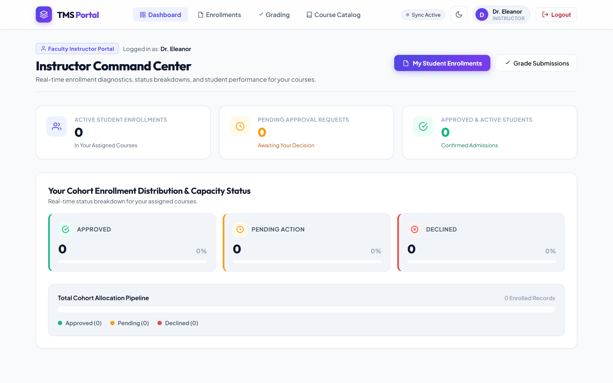
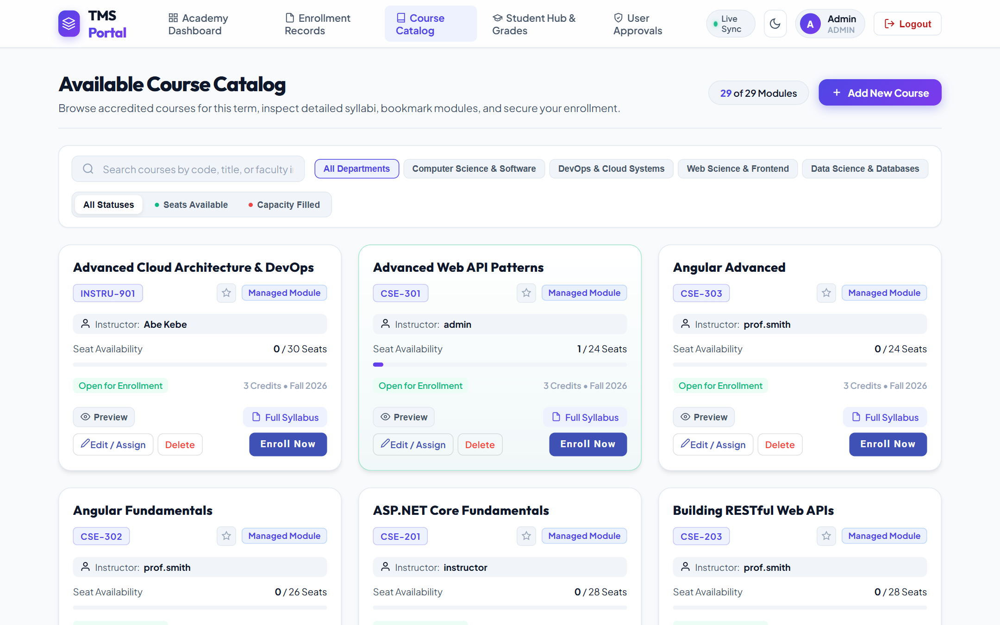
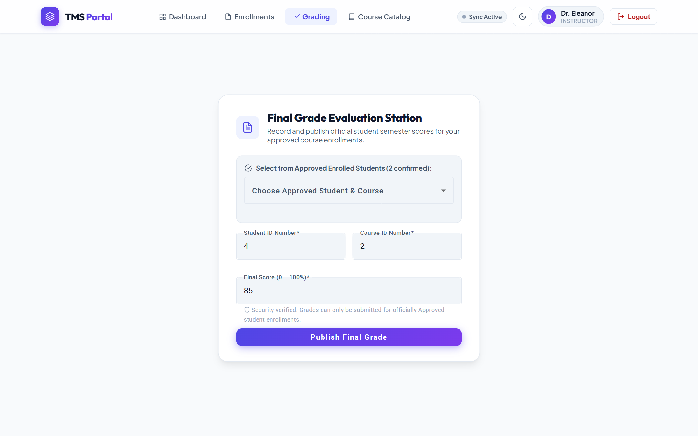
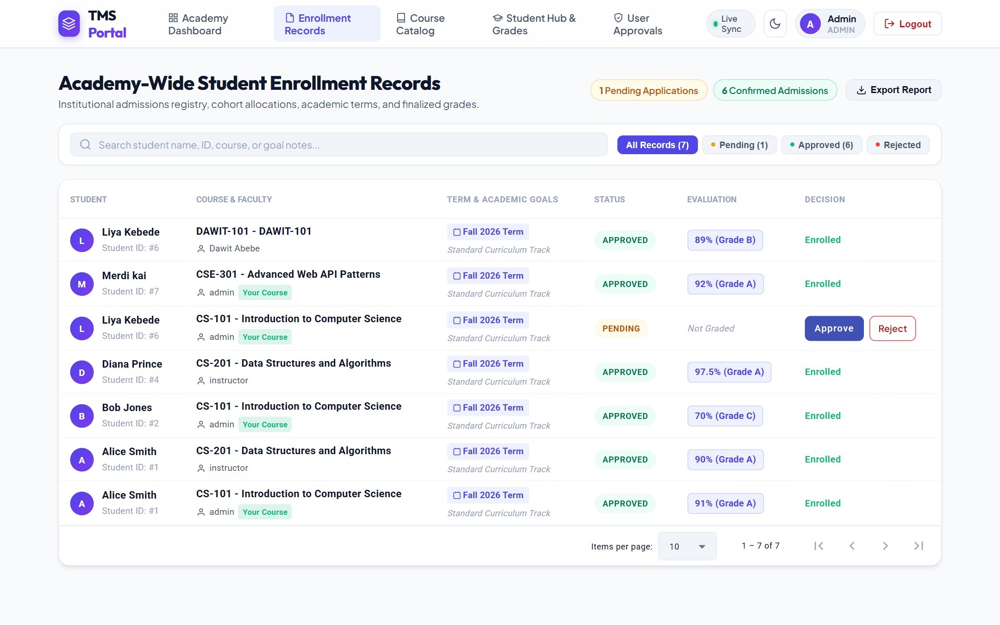
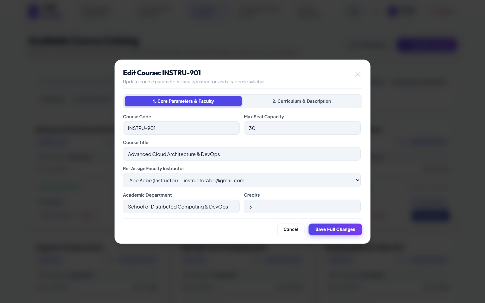
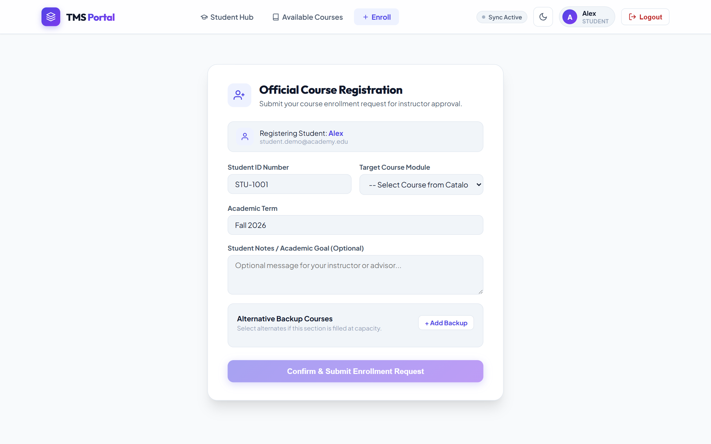
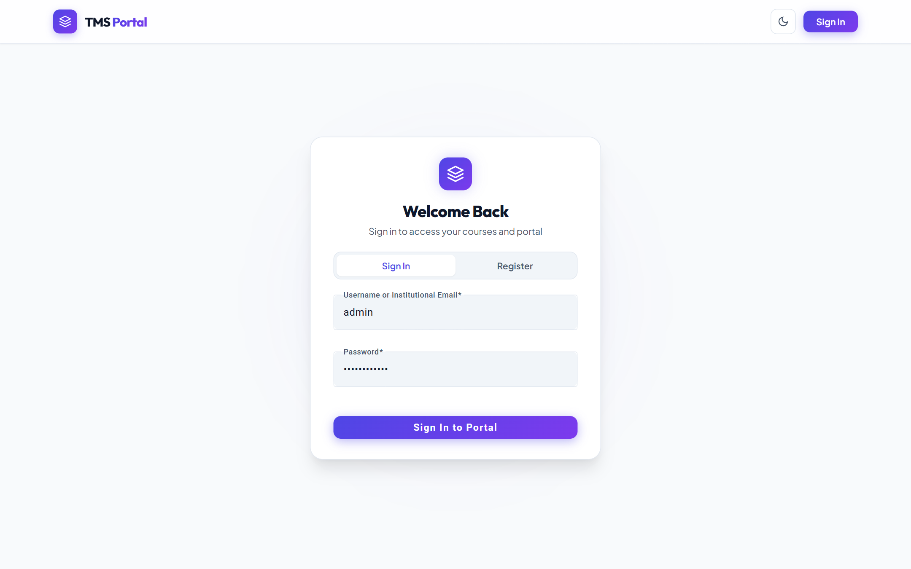
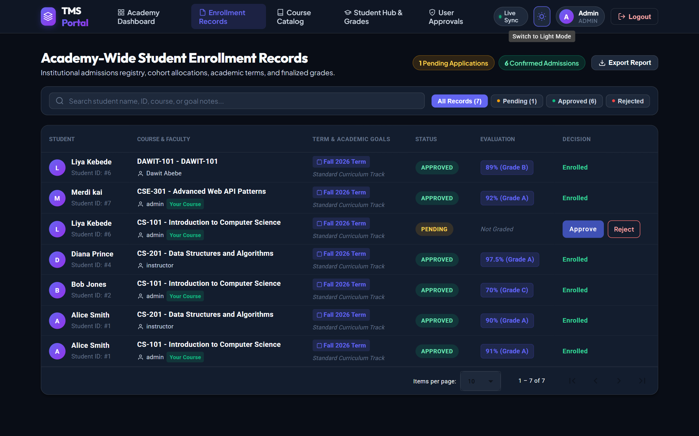

<h1 align="center">🎓 Training Management System (TMS) — Frontend Portal</h1>

<p align="center">
  <strong>Next-Generation Enterprise Academy & Course Lifecycle Platform</strong><br>
  Built with Angular 22 Zoneless, NgRx SignalStore, Angular Material, SignalR, Vitest, and Playwright E2E.
</p>

<p align="center">
  
  
  
  
  
  
</p>

---

## 🌟 Role-Based Application Visual Showcase

<table>
  <tr>
    <td width="50%" align="center">
      <strong>👩‍🏫 Faculty Instructor Command Center</strong><br>
      <em>Real-time enrollment diagnostics, status charts, & grading queues</em><br><br>
      
    </td>
    <td width="50%" align="center">
      <strong>👨‍🎓 Student Academic Progress Hub</strong><br>
      <em>Degree milestones, GPA target calculators, & enrolled courses</em><br><br>
      
    </td>
  </tr>
  <tr>
    <td width="50%" align="center">
      <strong>📚 Dynamic Course Catalog</strong><br>
      <em>Live seat capacity tracker, department filters, & instructor credits</em><br><br>
      
    </td>
    <td width="50%" align="center">
      <strong>🛡️ Administrator Command Center</strong><br>
      <em>Academy-wide operations, faculty allocations, & admissions metrics</em><br><br>
      
    </td>
  </tr>
</table>

---

## 📖 Overview

The **TMS Frontend Client** is an enterprise-grade Single Page Application (SPA) designed for higher education academies and corporate training institutions. It delivers tailored role-based portals for **Students**, **Faculty Instructors**, and **Academy Administrators**.

Built on **Angular 22** using the modern **zoneless paradigm**, this platform leverages **Signal-based reactivity**, **NgRx SignalStore**, and WebSocket synchronization via **Microsoft SignalR** for real-time enrollment updates, diagnostics, and grading workflows.

---

## 📸 Comprehensive Role & Feature Showcase

### 👩‍🏫 1. Faculty Instructor Portal & Real-Time Diagnostics
> Live status diagnostics, KPI metrics (Active Students, Pending Requests, Confirmed Admissions), and dynamic status breakdown analytics.
<p align="center">
  
</p>

---

### 🎯 2. Instructor Gradebook & Evaluation Submissions
> Instructor grading console with student cohort selector, course score inputs, automated GPA / letter grade calculations, and permission validation.
<p align="center">
  
</p>

---

### 👨‍🎓 3. Student Academic Progress Hub & Degree Tracker
> Program track selection (Software Engineering, Cloud & DevOps, Data & AI), GPA target calculators, earned credits milestones, and enrolled course cards.
<p align="center">
  
</p>

---

### 🛡️ 3. Institutional Administrator Operations & Admissions Registry
> Complete admissions and enrollment records with instant search, live status filter chips (Pending, Approved, Rejected), and one-click approvals.
<p align="center">
  
</p>

---

### 📚 4. Course Catalog & Capacity Tracker
> Academic course offerings with real-time seat capacity progress bars, credit tags, department filters, and instructor assignments.
<p align="center">
  
</p>

---

### ✏️ 5. Course Metadata & Faculty Assignment Modal
> Interactive modal dialog for updating course metadata, instructor assignments, and capacities.
<p align="center">
  
</p>

---

### 📝 6. Student Course Application & Enrollment Form
> Dedicated application form with pre-filled course selections, validation rules, and submission handlers.
<p align="center">
  
</p>

---

### 🔐 7. Secure Institutional Authentication
> Glassmorphism authentication portal with institutional email validation, password security controls, and responsive inputs.
<p align="center">
  
</p>

---

### 🌓 8. Dark & Light Theme Support
<table>
  <tr>
    <td width="50%" align="center">
      <strong>Dark Mode Theme</strong><br>
      
    </td>
    <td width="50%" align="center">
      <strong>Light Mode Theme</strong><br>
      
    </td>
  </tr>
</table>

---

## 🏗️ Architecture & Technology Stack

| Layer | Technologies & Libraries |
|---|---|
| **Framework** | Angular 22 (Standalone Components, Zoneless Signals) |
| **State Management** | `@ngrx/signals` (SignalStore with Entities & Computed Signals) |
| **Real-Time Sync** | `@microsoft/signalr` (WebSocket Hub Connection) |
| **UI Design System** | Angular Material, Custom SCSS Glassmorphism Design System, Lucide Vector Icons |
| **Unit & Store Testing** | Vitest (`@angular/build:unit-test`), `HttpTestingController` |
| **End-to-End Testing** | Playwright with Session `storageState` authentication reuse |
| **Temporal Dates** | `@js-temporal/polyfill` |

---

## 🚀 Getting Started

### Prerequisites
- **Node.js**: `v20.x` or higher
- **NPM**: `v10.x` or higher
- **Backend API**: Running at `http://localhost:5282`

### Installation
```bash
# Clone the repository
git clone https://github.com/Merdikai/tms-client.git
cd tms-client

# Install dependencies
npm install --legacy-peer-deps
```

### Running Locally
```bash
# Start the development server with API proxying
npm start
```
Navigate to `http://localhost:4200/` in your browser.

---

## 🧪 Comprehensive Testing Suite

The frontend is protected by a multi-layered testing safety net:

### 1. Unit, Service & SignalStore Tests (Vitest)
```bash
# Run tests in watch mode
npm test

# Run all specs once and exit
npm test -- --watch=false
```
**Specs Included:**
- `CourseCardComponent`: Signal input binding, output events, and routerLink providers.
- `EnrollmentService`: HTTP request matching and mocking with `HttpTestingController`.
- `EnrollmentStore`: State seeding, entity management, and computed `pendingCount()` verification.
- `Dashboard & Chart Components`: Mock dependencies and change detection stability.

### 2. End-to-End Tests (Playwright)
```bash
# Run full E2E test suite (Headless)
npx playwright test

# Run E2E tests with UI runner
npx playwright test --ui

# View HTML Test Report
npx playwright show-report
```

---

## 📁 Project Directory Structure

```text
tms-client/
├── e2e/                             # Playwright E2E test suite
│   ├── auth.setup.ts                # Session state auth setup
│   └── admin-approve-enrollment.spec.ts # Happy-path browser journeys
├── public/                          # Static assets and icons
│   └── docs/                        # Documentation & project screenshots
│       └── screenshots/             # Real UI captures (12 authentic views)
├── src/
│   ├── app/
│   │   ├── features/                # Route-level page components
│   │   │   ├── admin-users/         # User approval console
│   │   │   ├── course-detail/       # Single course view
│   │   │   ├── course-list/         # Course catalog & curriculum manager
│   │   │   ├── enrollment-form/     # Student course application form
│   │   │   ├── enrollment-list/     # Admissions registry
│   │   │   ├── grade-submission/    # Instructor gradebook
│   │   │   ├── instructor-dashboard/# Command center & KPI analytics
│   │   │   ├── login/               # Portal authentication & registration
│   │   │   └── student-dashboard/   # Degree tracker & academic goal hub
│   │   ├── guards/                  # Auth and Role route guards
│   │   ├── models/                  # TypeScript domain models & interfaces
│   │   ├── services/                # HTTP API services & SignalR client
│   │   ├── store/                   # NgRx SignalStores
│   │   └── ui/                      # Reusable presentational components
│   │       ├── analytics-chart/     # Custom status breakdown chart
│   │       └── course-card/         # Modern course card UI
│   ├── environments/                # Environment configuration
│   └── styles.scss                  # Global design tokens & styling
├── angular.json                     # Angular CLI & build configuration
├── playwright.config.ts             # Playwright test configuration
└── tsconfig.json                    # TypeScript compiler configuration
```

---

<p align="center">
  Crafted with excellence for the <strong>Training Management System</strong> ecosystem.
</p>
